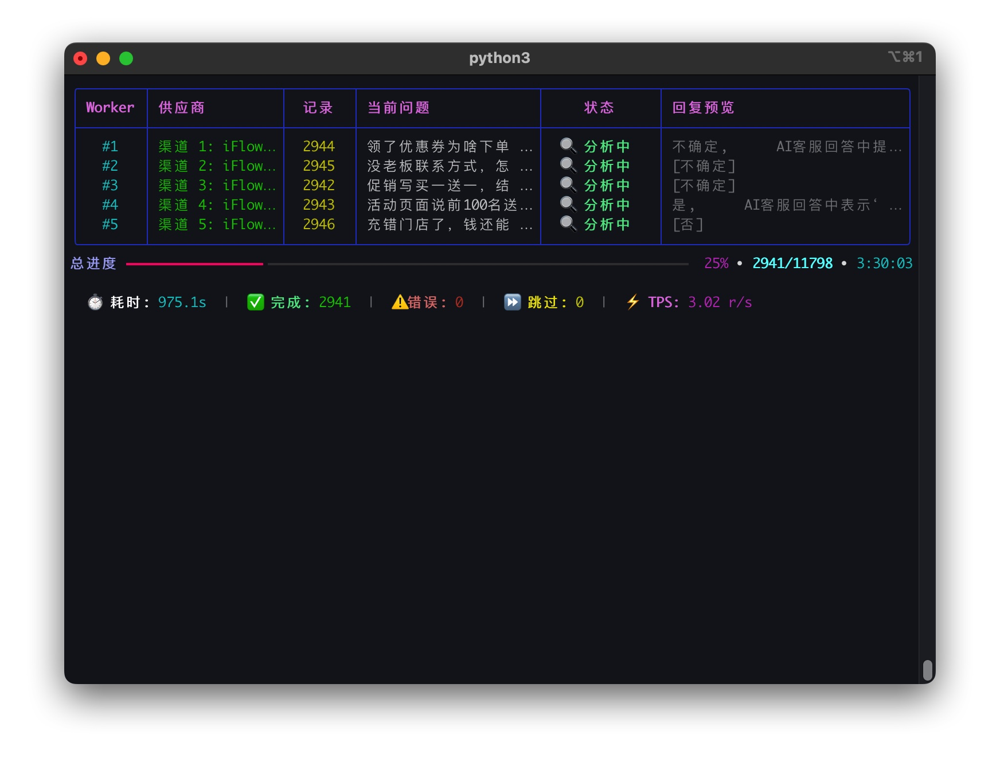

<div align="center">
<h1>🚀 AI客服问答语义比对工具</h1>
</div>
<div align="center">


</div>

## 📖 简介

这是一个用于评估 AI 客服回答与源知识库文档内容在语义上是否相符的专业工具。它旨在解决 AI 客服评估过程中的“幻觉检测”问题。

**🔥 现已全面升级为多渠道高并发架构！支持同时驱动多个 API 密钥，处理速度提升 10 倍以上。**

它通过调用主流 AI 供应商（Gemini, OpenAI, Anthropic, iFlow, Dify），对给定的问题、AI 回答和源文档进行深度解析，自动判断一致性并给出详细的判断理由。

### 📸 界面预览



_v4.0.0 全屏实时渲染界面：多 Worker 并行，秒级显示回复预览与智能解析逻辑_

---

## ✨ v4.0.0 核心突破

### ⚡ 多渠道高并发引擎

- **渠道级扩展**: 通过 `AI_CHANNEL_N` 配置多个独立渠道，每个渠道可拥有不同的服务商和并发数。
- **任务自动均衡**: 系统自动将 Excel 任务分发至所有活跃渠道，压榨硬件与带宽极限。
- **动态性能调整**: 支持通过 `ai_config.json` 实时调整各渠道的并发权重 (`concurrency`)。

### 🛡️ 智能预检与自愈

- **API 密钥自动验证**: 启动时自动拨测所有已配置渠道，静默剔除失效/受限密钥，确保任务无感中断。
- **鲁棒的异常重试**: 针对网络抖动、模型过载自动执行指数退避重试。

### 🖥️ WorkerTableUI 极致终端体验

- **全屏 Live 渲染**: 使用 `rich.Live` 全屏接管终端，彻底告别滚动残影。
- **流式预览系统**: 实时观察 AI 的思考脉络（Thinking）和正待生成的回复片段。
- **结果智能映射**: 自动提取语义分析的核心结论（是/否/不确定），并进行色彩高亮标注。

### 🔗 Dify 生态无缝集成

- **原生读取**: 直接解析 `dify_chat_tester` 生成的 Excel 报表，无需任何预处理。
- **自动映射**: 智能识别“原始问题”、“AI 响应”等字段，实现“点击即运行”的自动化流。

---

## 🛠️ 快速上手

### 1. 环境准备

推荐使用 **Bun** (Node 侧) 与 **UV** (Python 侧) 工具链以获得极致体验。

```bash
# 确保已安装 Python 3.10+
# 克隆仓库
git clone https://github.com/MisonL/semantic_tester.git
cd semantic_tester

# 安装依赖
uv sync
```

### 2. 配置渠道

1. 复制配置模板：`cp .env.config.example .env`
2. 编辑 `.env` 文件，配置您的 AI 渠道：

```bash
# =================== 多渠道高并发配置 ===================
# 示例：配置两个不同的 iFlow 渠道来实现负载均衡
AI_CHANNEL_1_NAME=iFlow-Main
AI_CHANNEL_1_API_KEY=sk-your-key-1
AI_CHANNEL_1_CONCURRENCY=10

AI_CHANNEL_2_NAME=iFlow-Backup
AI_CHANNEL_2_API_KEY=sk-your-key-2
AI_CHANNEL_2_CONCURRENCY=5

# Gemini 示例
AI_CHANNEL_3_NAME=Gemini-Flash
AI_CHANNEL_3_API_KEY=your-gemini-key
AI_CHANNEL_3_CONCURRENCY=2

# 也可以配置传统的全局密钥 (兼容模式)
IFLOW_API_KEY=sk-xxx
IFLOW_MODEL=qwen3-max
```

> **💡 提示词调优**: 您可以通过修改 `SEMANTIC_CHECK_PROMPT` 来自定义判断逻辑。详细文档请见 [AI_PROMPT_CONFIG.md](docs/AI_PROMPT_CONFIG.md)。

### 3. 准备数据

- **Excel**: 包含 `问题点`、`AI客服回答`、以及 `文档名称`。
- **知识库**: 将 Markdown 文档放至 `kb-docs/` 目录中，文件名对应 Excel 中的文档名称。

### 4. 启动运行

```bash
# 交互模式
uv run python main.py

# 快速模式
uv run python main.py <Excel路径> <知识库路径>
```

---

## 🏗️ 项目架构 (v4.0.0 Modularity)

```
semantic_tester/
├── api/             # 供应商驱动框架 (Gemini, OpenAI, iFlow, Dify...)
├── config/          # 高级环境配置管理 (Multi-Channel 核心逻辑)
├── excel/           # 线程安全的 Excel 并行读写引擎
├── ui/              # 基于 Rich 的 Worker 集群状态渲染
└── utils/           # 格式化、日志、JSON 手术刀解析工具
```

---

## 📦 打包与分发

项目支持生成跨平台可执行文件（已集成 Windows SSL DLL 修复补丁）：

- **macOS**: `bash build/build_macos.sh`
- **Windows**: `build\build_windows.bat`
- **发布**: `bash build/publish_release.sh` (自动生成 GitHub/GitLab Release 并在企微播报)

---

## 📜 许可证

本项目基于 [MIT 许可证](LICENSE)。

## 👤 作者

- **作者**: Mison
- **邮箱**: 1360962086@qq.com
- **主站**: [GitHub/MisonL](https://github.com/MisonL)

---

**✅ 经深度优化的生产级工具，助您轻松掌控大规模 QA 语义评估。**
